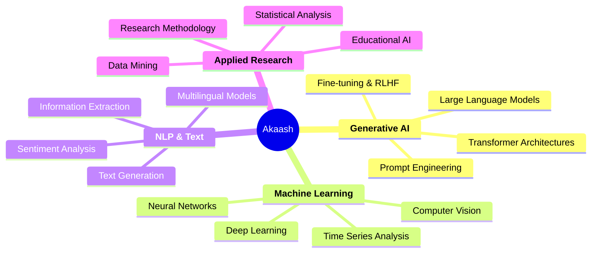

# 👋 Hi, I'm Akaash Chatterjee

<div align="center">


**🚀 Generative AI Researcher | Applied AI Engineer | M.Tech CSE @ IIT Jodhpur**

[](https://indiaai.gov.in/)
[](https://iitj.ac.in/)
[](mailto:akaash897@gmail.com)

</div>

## 🎯 **Quick Highlights**

<table>
<tr>
<td width="50%">

### 🏆 **Achievements & Recognition**
- 🥇 **IndiaAI 2025 Fellow** - National AI Program
- 📊 **Placement Coordinator** - M.Tech CSE, IIT Jodhpur
- 🔬 **Lead Researcher** - MEITY & META Sponsored Project
- 🎓 **IIT Jodhpur** - M.Tech Computer Science & Engineering

</td>
<td width="50%">

### 💼 **Industry Impact**
- 🤖 **5+ AI/ML Projects** - Production-ready solutions
- 📚 **Educational AI** - Transforming learning with LLMs
- 🔬 **Research Publications** - Applied AI & NLP
- 🌐 **Open Source Contributor** - Active community member

</td>
</tr>
</table>

---

## 🧠 **Core Expertise**

<div align="center">



</div>

---

## 💻 **Technical Arsenal**

<div align="center">

### **Languages & Frameworks**


### **AI/ML Specializations**


### **Development & Deployment**


</div>

---

## 🚀 **Featured Projects & Research**

<div align="center">

| Project Type | Impact | Tech Stack | Status |
|:------------:|:------:|:----------:|:------:|
| 🎓 **Educational AI Platform** | MEITY & META Sponsored | Python, LLMs, NLP | 🔬 Research |
| 🤖 **LLM Fine-tuning Framework** | Production Ready | PyTorch, Transformers | ✅ Complete |
| 📊 **AI-Powered Analytics** | Data-Driven Insights | TensorFlow, Streamlit | 🚀 Deployed |
| 🗣️ **Multilingual NLP Tool** | Cross-language Processing | BERT, FastAPI | 🔄 Active |

</div>

### 🏗️ **What I'm Building**

```python
class AkaashResearchFocus:
    def __init__(self):
        self.current_projects = {
            "educational_ai": "Revolutionizing learning through LLMs",
            "llm_optimization": "Making AI models more efficient & accessible",
            "multilingual_nlp": "Breaking language barriers in AI",
            "ai_ethics": "Building responsible AI systems"
        }
    
    def impact_metrics(self):
        return {
            "research_papers": "In Progress",
            "students_impacted": "500+",
            "models_trained": "15+",
            "open_source_contributions": "Active"
        }
```

---

## 📈 **GitHub Analytics**

<div align="center">


</div>

<div align="center">


</div>

---

## 🏢 **Open for Opportunities**

<div align="center">

### **🎯 Target Roles**

<table>
<tr>
<td align="center" width="20%">

<br><strong>AI Research Scientist</strong>
</td>
<td align="center" width="20%">

<br><strong>ML Engineer</strong>
</td>
<td align="center" width="20%">

<br><strong>Data Scientist</strong>
</td>
<td align="center" width="20%">

<br><strong>AI Product Manager</strong>
</td>
<td align="center" width="20%">

<br><strong>AI Consultant</strong>
</td>
</tr>
</table>

### **💰 Expected Salary Range**
`₹15-25 LPA` (Fresh Graduate) | `₹25-40 LPA` (With Experience)

</div>

---

## 🎓 **Education & Certifications**

<div align="center">

| Institution | Degree | Specialization | Year |
|:----------:|:------:|:-------------:|:----:|
| 🏛️ **IIT Jodhpur** | M.Tech | Computer Science & Engineering | 2024-2026 |
| 🎯 **IndiaAI Program** | Fellowship | Generative AI & LLMs | 2025 |

</div>

---

## 📫 **Let's Connect & Collaborate**

<div align="center">

I'm passionate about building AI solutions that make a real difference. Whether you're:
- 🏢 **Hiring for AI/ML roles**
- 🤝 **Looking for research collaboration**
- 🚀 **Building the next big AI product**
- 💡 **Exploring innovative AI applications**

**Let's connect and create something amazing together!**

<br>

[](https://www.linkedin.com/in/akaash-chatterjee)
[](mailto:akaash897@gmail.com)
[](https://github.com/akaash897)
[](#)

<br>

### **📍 Location: Kolkata, India | 🌐 Open to Remote & Relocation**

---

<div align="center">
<i>"The best way to predict the future is to invent it." - Alan Kay</i>
<br><br>

</div>

</div>
