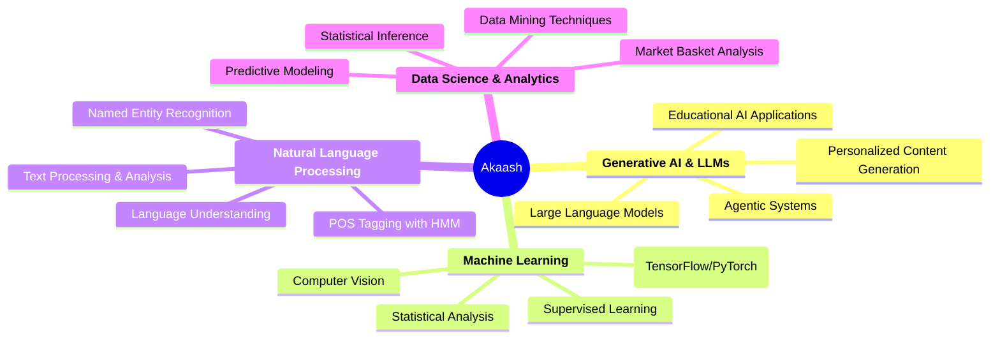

# 👋 Hi, I'm Akaash Chatterjee

<div align="center">


**🚀 IndiaAI Fellow 2025 | M.Tech CSE @ IIT Jodhpur | Generative AI Researcher**

[](https://indiaai.gov.in/)
[](https://iitj.ac.in/)
[](mailto:akaash897@gmail.com)

</div>

## 🎯 **Quick Highlights**

<table>
<tr>
<td width="50%">

### 🏆 **Achievements & Recognition**
- 🥇 **IndiaAI Fellow 2025** - META & Govt of India Sponsored
- 🎓 **GATE CS 2024: AIR 1561** - Top 1.5% Nationally
- 🔬 **GATE DSAI 2024: AIR 4292** - Data Science & AI Track
- 📊 **Placement Coordinator** - M.Tech CSE, IIT Jodhpur
- 🏛️ **IIT Jodhpur M.Tech Student** - Premier Technology Institute

</td>
<td width="50%">

### 💼 **Research Impact**
- 🔬 **"Personalized Example Generation for Education using GenAI"** - IndiaAI Fellowship Project
- 🤖 **Agentic System for Aiding Exam Evaluation and Personalization** - AI-powered assessment tools

</td>
</tr>
</table>

---

## 🧠 **Core Expertise & Research Focus**

<div align="center">



</div>

---

## 💻 **Technical Arsenal**

<div align="center">

### **Programming & Core Technologies**


### **AI/ML Frameworks & Libraries**


### **LLM & GenAI Tools**


### **Development & Deployment**


### **Data Science & Visualization**


</div>

---

## 🚀 **Featured Projects & Research**

### 🎓 **Current Research - IndiaAI Fellowship 2025**

**🏆 IndiaAI Fellowship 2025 - National AI Excellence Program**

<div align="center">

| **Program Details** | **Fellowship Information** |
|:------------------:|:---------------------------:|
| 🏢 **Sponsors** | META & Government of India |
| 🎯 **Program** | Srijan: GenAI Centre of Excellence |
| 🔬 **Research Area** | Generative AI for Education |
| 💰 **Funding** | Full Research Fellowship |
| 📅 **Duration** | 2025 (12 months) |
| 🎓 **Selection** | National Competitive Process |

</div>

**🔬 Research Project**: *"Personalized Example Generation for Education Vertical using Generative AI"*

**Key Research Objectives:**
- 🎯 **Personalized Learning**: Develop LLM-powered systems to generate customized educational examples
- 🤖 **Agentic Evaluation**: Build intelligent agents for automated exam evaluation and feedback
- 📚 **Educational Innovation**: Transform traditional learning methodologies using GenAI
- 🔧 **Scalable Solutions**: Create production-ready tools for educational institutions

**Research Impact & Significance:**
- 🌟 **National Importance**: Part of India's strategic AI development initiative
- 🤝 **Industry Collaboration**: Direct partnership with META's research division
- 🎓 **Educational Transformation**: Pioneering AI-driven personalized education in India
- 🚀 **Innovation Pipeline**: Contributing to next-generation EdTech solutions

<div align="center">

| 🔬 **Research Projects** | 🎯 **Impact** | 🛠️ **Tech Stack** | 📊 **Results** |
|:------------------------:|:-------------:|:------------------:|:---------------:|
| **Educational AI Platform** | META & IndiaAI Sponsored | LLMs, LangChain, HuggingFace | 🔬 Ongoing Research |
| **Satellite Image Enhancement** | Computer Vision Innovation | TensorFlow, OpenCV, Streamlit | 🏆 SSIM: 0.85, Lowest MSE |
| **Market Basket Analysis** | Retail Strategy Optimization | Custom Apriori, NetworkX | ✅ Cross-country Insights |
| **Asteroid Classification** | Space Research Application | XGBoost, CatBoost, ML Pipeline | 🎯 99.58% Accuracy |

</div>

### 🏗️ **Key Project Highlights**

```python
class AkaashResearchPortfolio:
    def __init__(self):
        self.current_research = {
            "fellowship": "IndiaAI 2025 - Personalized Education with GenAI",
            "focus_area": "LLMs for Educational Content Generation",
            "sponsors": ["META", "Government of India"],
            "status": "Active Research & Development"
        }
        
        self.key_projects = {
            "satellite_enhancement": {
                "achievement": "Highest SSIM (0.85) with CNN-based model",
                "techniques": ["CNN Super-Resolution", "Wavelet-SR", "Wiener-SR"],
                "deployment": "Real-time Streamlit interface"
            },
            "asteroid_classification": {
                "accuracy": "99.58% with XGBoost",
                "data_handling": "Advanced preprocessing & class balancing",
                "models_compared": ["Random Forest", "XGBoost", "CatBoost", "KNN"]
            },
            "market_analysis": {
                "algorithm": "Custom-built Apriori from scratch",
                "scope": "Multi-country consumer behavior analysis",
                "business_impact": "Sales strategy & inventory optimization"
            }
        }
    
    def get_achievements(self):
        return {
            "gate_rank": "AIR 1561 (CS), AIR 4292 (DSAI)",
            "academic_performance": "A grade in AI (10/10), A- in ML (9/10)",
            "certifications": ["HuggingFace Agents", "Neo4j LLM", "Data Science"],
            "leadership": "Placement Coordinator MTech CSE"
        }
```

---

## 📈 **GitHub Analytics & Activity**

<div align="center">


</div>

<div align="center">


</div>

### 🌟 **Featured Repositories**
- 🤖 **[AI_Evaluator_Helper](https://github.com/akaash897/AI_Evaluator_Helper)** - AI-powered evaluation assistant
- 🧠 **[ML_Course](https://github.com/akaash897/ML_Course)** - Comprehensive ML learning materials
- 📊 **[market-basket-analysis](https://github.com/akaash897/market-basket-analysis)** - Custom Apriori implementation
- 🛰️ **[Computer_Vision](https://github.com/akaash897/Computer_Vision)** - Satellite image enhancement projects
- 🔤 **[Named_Entity_Recognition](https://github.com/akaash897/Named_Entity_Recognition)** - NLP implementation
- 🏷️ **[POS_Tagging_HMM](https://github.com/akaash897/POS_Tagging_HMM)** - Hidden Markov Model for POS tagging

---

## 🏢 **Open for Opportunities**

<div align="center">

### **🎯 Target Roles & Opportunities**

<table>
<tr>
<td align="center" width="16.66%">
🤖
<br><strong>Junior AI Engineer</strong>
<br><em>ML Model Development</em>
</td>
<td align="center" width="16.66%">
📊
<br><strong>Data Scientist</strong>
<br><em>Analytics & Insights</em>
</td>
<td align="center" width="16.66%">
🔬
<br><strong>Research Associate</strong>
<br><em>AI/ML Research</em>
</td>
<td align="center" width="16.66%">
🎓
<br><strong>EdTech Developer</strong>
<br><em>Educational AI</em>
</td>
<td align="center" width="16.66%">
💻
<br><strong>Software Engineer</strong>
<br><em>AI/ML Focus</em>
</td>
<td align="center" width="16.66%">
🚀
<br><strong>AI Product Analyst</strong>
<br><em>Product Development</em>
</td>
</tr>
</table>

**🌟 Open to diverse opportunities in**: Startups, Research Labs, Product Companies, EdTech, FinTech, HealthTech

</div>

---

## 🎓 **Education & Academic Excellence**

<div align="center">

| 🏛️ **Institution** | 📜 **Degree** | 📊 **Performance** | 📅 **Year** |
|:------------------:|:--------------:|:------------------:|:------------:|
| **IIT Jodhpur** | M.Tech CSE | **CGPA: 7.97/10** | 2024-2026 |
| **Netaji Subhash Engg College** | B.Tech CSE | **CGPA: 9.14/10** | 2020-2024 |
| **South Point High School** | Class XII (CBSE) | **90.2%** | 2020 |
| **South Point High School** | Class X (CBSE) | **96.0%** | 2018 |

### 🏆 **Key Academic Achievements**
- 🥇 **GATE CS 2024**: AIR 1561 (Top 1.5% nationally)
- 🥈 **GATE DSAI 2024**: AIR 4292 (Data Science & AI Track)
- 🎓 **IndiaAI Fellowship 2025**: National competitive selection
- 🏛️ **IIT Jodhpur M.Tech**: Premier technology institute

</div>

---

## 🏅 **Certifications & Professional Development**

<div align="center">

| 🏷️ **Certification** | 🏢 **Provider** | 📅 **Year** | 🔗 **Verification** |
|:--------------------:|:--------------:|:------------:|:-------------------:|
| **HuggingFace Agents Course** | HuggingFace | 2025 | ✅ Verified |
| **Neo4j and LLM Fundamentals** | Neo4j | 2025 | ✅ Verified |
| **Data Science Certification** | Internshala | 2023 | ✅ Verified |

</div>

---

## 💼 **Leadership & Responsibilities**

- 🎯 **Placement Coordinator** - MTech CSE (2025-2026) | IIT Jodhpur
- 👥 **Class Committee Member** - MTech CSE 2024 Batch | IIT Jodhpur
- 🤝 **Student Volunteer** - Office of Corporate Relations, DoRA | IIT Jodhpur

---

## 📫 **Let's Connect & Collaborate**

<div align="center">

I'm passionate about pushing the boundaries of AI, especially in education and research. Whether you're:
- 🏢 **Recruiting for AI/ML roles** (Research Scientist, ML Engineer, Data Scientist)
- 🤝 **Seeking research collaboration** in GenAI, LLMs, or Educational AI
- 🚀 **Building innovative AI products** or EdTech solutions
- 💡 **Exploring cutting-edge AI applications** for real-world problems

**Let's connect and create the future together!**

<br>

[](https://www.linkedin.com/in/akaash-chatterjee)
[](mailto:akaash897@gmail.com)
[](mailto:m24cse002@iitj.ac.in)
[](https://github.com/akaash897)

<br>

### **📱 Contact: +91-8334061878 | 📍 Kolkata, India**
### **🌐 Open to Remote Work & Relocation | 🎯 Available For FTE From May 2026**

---

<div align="center">
<i>"The future belongs to those who understand both the art and science of AI."</i>
<br><br>

</div>

</div>
